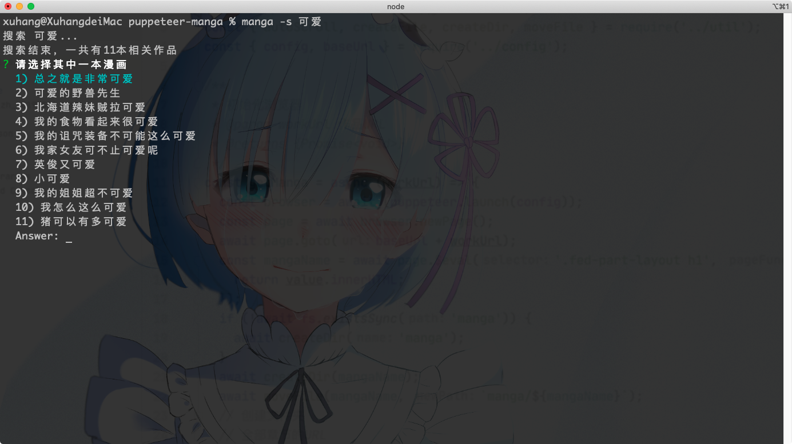

## 记录用puppeteer抓取漫画的一次实践  

### 1.起因

&nbsp;&nbsp;&nbsp;在一个星期六还在加班的夜晚，身心已经很疲惫了，起身倒了牛奶，打开了B站，想看看最近有没有什么新番。曾经的二次元死宅，到如今几个月都没看过纸片人了。怀着偷懒的心情，我打开了哔哩哔哩，在新番放送表上有一部成功引起了我注意的番，


 《总之就非常的🍋》一下子看完了几集，发现根本不够看啊，想继续看下去，然后打开了哔哩哔哩漫画，搜了一下居然要


&nbsp;&nbsp;&nbsp;我平常是很少看漫画，突然要花60大洋买这漫画确实有点舍不得(其实是因为穷)，于是我就网上搜各大网站的资源，后来觉得在电脑上点来点去好不舒服，要是可以转成epub格式的漫画，我就可以在手机自带的图书软件上阅读了，于是我又在GitHub上搜索有没有开源的下载漫画程序，转转停停，我发现了一个用rust编写的cli程序，项目名为[mikack-cli](https://github.com/Hentioe/mikack-cli)，经过一番了解，该程序支持ONE漫画网站的爬取，正当准备下载漫画的时候，程序跳出来报异常了说不支持该域名，发现ONE 漫画的域名改过了，我从作者的另外一个库[ mikack](https://github.com/Hentioe/mikack)中发现域名更改的issues，由于是cli程序是基于这个库的，我问了问作者，回答是


作者的回答看上去还需要一段时间来完成，但我想看(白嫖)漫画的心是不接受的。

### 2.自己动手

#### 分析

我以我微薄的认知稍微分析了一下：  

1. 我没有任何专业爬虫的经验，所以专业的爬虫库都排除掉

2. 脑中浮现出的解决办法是：“我可以打开个浏览器让它自己一张、一章的保存吗？”(或许这就是非专业人士的想法吧😂)

3. 既然是操作浏览器，还要保存文件，那NodeJS就成首选了

4. [puppeteer](https://github.com/puppeteer/puppeteer)是一个无头的chrome，你可以编写脚本来控制它为你做任何你在浏览器上做的事，这对于我这实现这想法是最合适不过了

我抓取的网站是[coco漫画](https://www.cocomanhua.com/)原ONE漫画，首先要对网站进行初步的分析：  

1. 每个作品都有对应的编号  


2. 这一块可以获取全部章节的URL  


3. 漫画页面有懒加载机制  

   

#### 思路

1. 利用puppeteer来获取到作品的全部章节
2. 模拟人操作，让浏览器慢慢往下滚动
3. 同时监听浏览器的response事件，过滤掉其他非图片的内容，保存成图片文件

#### 开发

&nbsp;&nbsp;&nbsp;受到[mikack-cli](https://github.com/Hentioe/mikack-cli)项目的启发，我决定用命令行的方式来开发此程序，用的包分别是[ commander.js](https://github.com/tj/commander.js)和[Inquirer.js](https://github.com/SBoudrias/Inquirer.js)。开发的过程中并没有什么太大的困难，由于是第一次使用puppeteer，要稍微注意一下page的对象操作就行了。此外，由于操作浏览器的原因，存在的大量的异步操作，所以代码满地的 `async` `await`语句。下面放几张截图  

1. 帮助


2. 搜索




3.下载


#### 问题

1. 这个程序有着一个致命的缺点：保存太慢。但是我目前暂时没有办法去解决它，由于网络和懒加载的原因，只能模仿人的操作，一点一点的让浏览器往下滚动，保证每一张都能成功加载和保存。

2. 我成功利用[ epub-gen](https://github.com/cyrilis/epub-gen)转换成epub的格式，但是效果不太满意，放两张图对比一下

   

   

     

   &nbsp;&nbsp;&nbsp;第一张是我用epub-gen转的，第二张是在GitHub上的[epub-manga-creator](https://github.com/wing-kai/epub-manga-creator)项目转换过来的，据这个作者介绍，他是按照[DIgital-Comic-Association](http://www.digital-comic.jp/) (デジタルコミック協議会)的规范来制作的，当然我不是这方面的专家，所以暂时没能迁移过来，后续我看看规范和该项目作者的源码，来达到转成第二张的效果。

   

   

   3. &nbsp;&nbsp;&nbsp;目前只达到了我下载漫画的目的，还没试过连续下载的效果，程序会不会崩溃暂时不知道，至少在我开发的时候，是没遇到过的，后续我会持续更新和优化，不断的探索新的解决方法。

   

   #### 后续

   1. - [ ] デジタルコミック協議会epub文件规范实现
   2. - [ ] 编写后台服务将程序API化，实现web管理、定时爬取等服务

   #### 使用、开发

   如果有同学想自己尝试使用或者开发，可以clone到本地，代码有很多注释，实现逻辑也不难。[项目地址](https://github.com/XavierXuV5/manga)，需要注意的是我这里采用了[puppeteer-core](https://www.npmjs.com/package/puppeteer-core)，启动的是本地的Chrome，使用前请检查是否有安装Chrome浏览器。你还可以使用[puppeteer](https://www.npmjs.com/package/puppeteer)，因为它自带Chromium。

   ```shell
   首先安装nodejs和yarn
   1. git clone https://github.com/XavierXuV5/manga
2. yarn install
   3. yarn link  // 删除 yarn unlink
   4. manga -h
   ```
   
   

### 3.谈谈

&nbsp;&nbsp;&nbsp;平时闲着的时候，就想着写点小工具来玩玩，自己并不是这方面的专家，也没有深入的去学习这方面的知识，所以写的很多东西并不专业，就只能实现我的想法。简单一句话概括，有了想法就去实现，仅此而已。  

&nbsp;&nbsp;&nbsp;自己也在这过程中享受到了快乐，也增长了见识，这就足矣。如果有人有更好的想法，也可以和我一起讨论一下，毕竟一个人的想法有限，多尝试才是王道。

